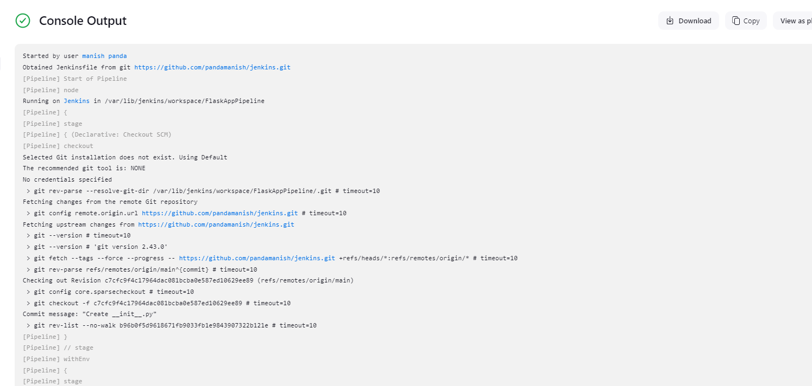

# Jenkins CI/CD Pipeline for Python Web Application
This document guides through setting up a Jenkins pipeline on an AWS EC2 instance for automating the testing and deployment of a Python web application.

# Prerequisites
AWS EC2 Instance: Ensure having an Ubuntu EC2 instance set up on AWS.
Security Groups: Opened ports 8080 for Jenkins and 22 for SSH.
IAM Role: Attach an IAM role to the EC2 instance with access to S3, CloudWatch, and other necessary AWS services.

# Setup Steps
1. Created a EC2 Instance
   Created a EC2 instance for hosting Jenkins web through EC2.
   
2. Installed Jenkins on AWS EC2
Updated and installed Java, Jenkins, and Git on EC2 instance:
For configuring we followed these below steps:

# Update the package list and install Java
sudo apt update
sudo apt install -y openjdk-11-jdk

# Add Jenkins repository and key
wget -q -O - https://pkg.jenkins.io/debian/jenkins.io.key | sudo apt-key add -
sudo sh -c 'echo deb http://pkg.jenkins.io/debian-stable binary/ > /etc/apt/sources.list.d/jenkins.list'

# Install Jenkins and Git
sudo apt update
sudo apt install -y jenkins git

# Start and enable Jenkins
sudo systemctl start jenkins
sudo systemctl enable jenkins

# Confirm Jenkins is running
sudo systemctl status jenkins

3. Access Jenkins and Complete Setup
Opened Jenkins by visiting http://http://44.242.135.191:8080 in my browser.
retrieved the initial admin password:
sudo cat /var/lib/jenkins/secrets/initialAdminPassword

Installed 3-4 plugins and created your Jenkins admin account.
In Jenkins, clicked on New Item.
Selected Pipeline, named it (FlaskAppPipeline), and clicked OK.
Under the pipeline configuration, selected Pipeline script from SCM.
Chose Git as the SCM and entered the URL of your GitHub repository.

4. Configure Jenkins with Python
Install Python3, pip, and virtual environment tools:
sudo apt install -y python3 python3-pip python3-venv

5. Clone the Application Repository
Used my github for app.py
Clone repository to the Jenkins server:
git clone https://github.com/pandamanish/jenkins.git

6. Create a Jenkins Pipeline (Jenkinsfile)
In the root of your cloned repository, create a Jenkinsfile to define the CI/CD pipeline with Build, Test, and Deploy stages.
Preview of code:
groovy Code:
pipeline {
    agent any
    stages {
        stage('Build') {
            steps {
                sh 'python3 -m venv venv'
                sh 'source venv/bin/activate && pip install -r requirements.txt'
            }
        }
        stage('Test') {
            steps {
                sh 'source venv/bin/activate && pytest tests/'
            }
        }
        stage('Deploy') {
            when {
                branch 'main'
            }
            steps {
                sh '''
                source venv/bin/activate
                gunicorn -w 4 -b 0.0.0.0:8000 app:app
                '''
            }
        }
    }
}
6. Set up Triggers for Jenkins
Opened the pipeline configuration in Jenkins, under Build Triggers, enable GitHub hook trigger for GITScm polling to trigger builds on new commits.
8. Test the Pipeline
Pushed changes to your repository and verify that Jenkins triggers the pipeline.
Checked that each stage completes successfully, including deploying to the specified staging environment.

